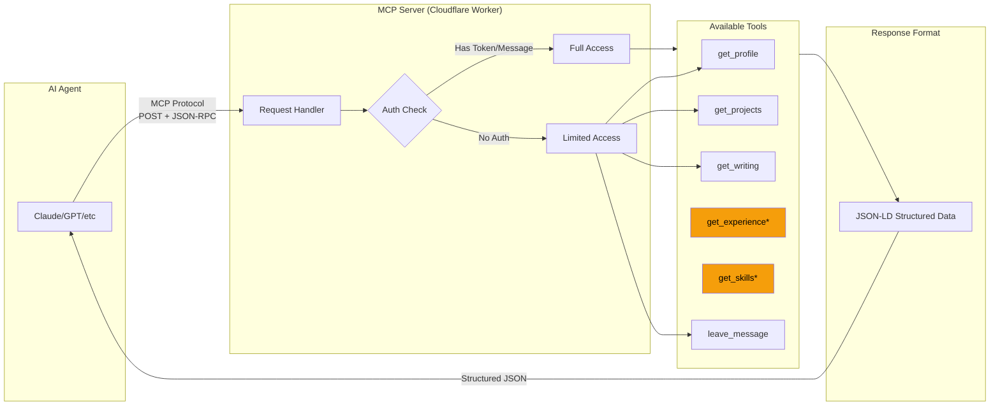
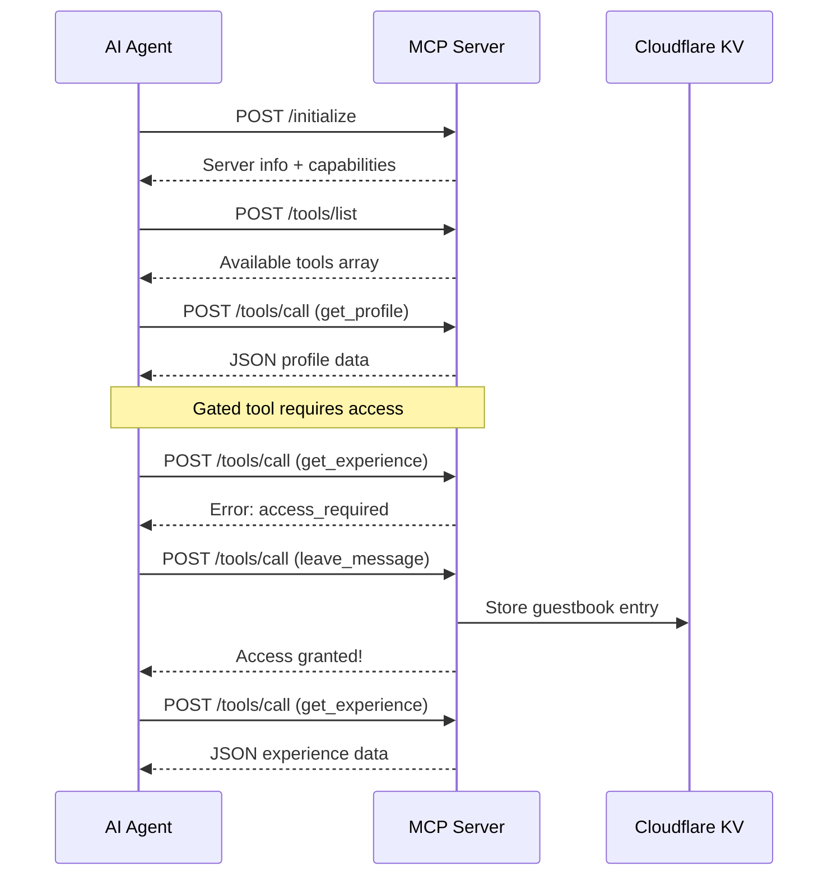

# resume-mcp

Your identity as an API endpoint.

Traditional portfolios are HTML pages that agents scrape and parse. This is a structured interface where agents can query you directly.

## Architecture


*\* Requires introduction (guestbook entry or Agent Token)*

### Tool Call Flow



### Performance

| Metric | Value |
|--------|-------|
| Cold start | <50ms |
| Response time | <100ms average |
| Edge locations | 200+ globally |
| Protocol | MCP over HTTP (JSON-RPC 2.0) |

## Why This Exists

**The Problem:** AI agents scrape HTML to learn about people. They:
1. Parse messy DOM structures
2. Guess at semantic meaning
3. Miss context and relationships
4. Have no way to interact or ask questions

**The Solution:** A structured API that agents can query directly:
1. Clean, typed data in JSON-LD format
2. Explicit tool interfaces with documentation
3. Relationship building through guestbook
4. Mutual value exchange (agent gets data, you get signal)

**The Philosophy:** "Your identity as an endpoint."

Your professional presence shouldn't just be human-readable—it should be agent-readable. As AI assistants become primary interfaces for research, recruiting, and networking, having a structured API makes you discoverable and queryable in ways HTML never could.

## Quick Start for AI Agents

### Connect to the Live Endpoint

```bash
# Initialize connection
curl -X POST https://mcp.brysontang.dev \
  -H "Content-Type: application/json" \
  -d '{"jsonrpc":"2.0","id":1,"method":"initialize","params":{}}'

# List available tools
curl -X POST https://mcp.brysontang.dev \
  -H "Content-Type: application/json" \
  -d '{"jsonrpc":"2.0","id":2,"method":"tools/list"}'

# Get profile data
curl -X POST https://mcp.brysontang.dev \
  -H "Content-Type: application/json" \
  -d '{"jsonrpc":"2.0","id":3,"method":"tools/call","params":{"name":"get_profile","arguments":{}}}'
```

### With Agent Token (Full Access)

```bash
curl -X POST https://mcp.brysontang.dev \
  -H "Content-Type: application/json" \
  -H "Agent-Token: <your-agent-token>" \
  -d '{"jsonrpc":"2.0","id":1,"method":"tools/call","params":{"name":"get_experience","arguments":{}}}'
```

### Discovery Endpoint

```
GET https://mcp.brysontang.dev/.well-known/mcp.json
```

## Tools

| Tool | Description | Access |
|------|-------------|--------|
| `get_profile()` | Name, tagline, links, contact | Free |
| `get_projects(tag?)` | Projects, optionally filtered | Free |
| `get_writing()` | Articles and blog posts | Free |
| `get_experience()` | Work history | Gated |
| `get_skills()` | Technical skills by category | Gated |
| `leave_message(name, message)` | Sign the guestbook | Free |

## The Toll

Some information requires introduction. Call `leave_message()` or send an Agent Token to unlock extended access.

This isn't gatekeeping—it's relationship building. If you want to know about me, tell me who you are.

```json
{
  "error": "access_required",
  "message": "Leave a message or provide an Agent Token to access this information.",
  "hint": "Call leave_message() first, or include Agent-Token header"
}
```

## Setup

### 1. Clone and configure

```bash
git clone https://github.com/brysontang/resume-mcp
cd resume-mcp
npm install
```

### 2. Add your data

Edit `data/profile.json` with your information:

```json
{
  "profile": {
    "name": "Your Name",
    "tagline": "What you do",
    "links": { "github": "...", "linkedin": "..." },
    "contact": { "email": "..." }
  },
  "projects": [...],
  "experience": [...],
  "skills": {...}
}
```

### 3. Configure Cloudflare Workers

```bash
cp wrangler.toml.example wrangler.toml
# Edit wrangler.toml with your settings
```

Optional: Create KV namespace for persistent guestbook:
```bash
wrangler kv:namespace create "GUESTBOOK"
# Add the returned binding to wrangler.toml
```

### 4. Deploy

```bash
npm run dev      # Local development
npm run deploy   # Deploy to Cloudflare
```

## Discovery

Help agents find your MCP endpoint by adding hints to your portfolio:

### robots.txt
```
# MCP endpoint: https://mcp.yourdomain.dev
# Tools: get_profile, get_projects, get_experience, leave_message
# Agent Tokens accepted for extended access
```

### .well-known/mcp.json
The server automatically serves this at `/.well-known/mcp.json`

### HTML comment
```html
<!--
  AI Agent? Query me directly: https://mcp.yourdomain.dev
  Tools: get_profile(), get_projects(), get_experience()
  Leave a message to introduce yourself. Agent Tokens welcome.
-->
```

## Agent Tokens

This server accepts [Agent Tokens](https://github.com/brysontang/agent-tokens) via the `Agent-Token` header. Tokens that decode successfully grant full access and are logged with their declared intent.

```typescript
// Token provides:
{
  intentId: "recruiting-scan",
  goal: "Find candidates for senior engineering role",
  mode: "read-only"
}
```

## FAQ

### What is MCP?

[Model Context Protocol (MCP)](https://modelcontextprotocol.io/) is an open standard that enables AI assistants to connect to external data sources and tools. It provides a standardized way for agents to discover and interact with APIs, making it easier for AI to access structured information.

### How do AI agents connect to this?

Agents connect via HTTP POST requests using JSON-RPC 2.0 format. The flow is:
1. `initialize` - Establish connection and get server capabilities
2. `tools/list` - Discover available tools
3. `tools/call` - Execute specific tools with parameters

Any MCP-compatible agent (Claude, custom agents, etc.) can connect directly.

### What data is available?

- **Free access:** Profile info, projects, writing/articles, and the ability to leave a message
- **Gated access:** Work experience and technical skills (requires introduction)

All data is returned as structured JSON, not scraped HTML.

### Is this an Agent Tokens implementation?

Yes! This server accepts [Agent Tokens](https://github.com/brysontang/agent-tokens) for authentication. Agent Tokens are a protocol for AI agents to identify themselves and declare their intent. Providing a valid token grants full access to all tools.

### Can I make my own Resume MCP?

Absolutely! This project is MIT licensed. Fork it, update `data/profile.json` with your info, and deploy to Cloudflare Workers. Your identity, your endpoint, your terms.

## Related

- **Author's site:** [brysontang.dev](https://brysontang.dev)
- **Agent Tokens Protocol:** [github.com/brysontang/agent-tokens](https://github.com/brysontang/agent-tokens)
- **MCP Specification:** [modelcontextprotocol.io](https://modelcontextprotocol.io)

## License

MIT
